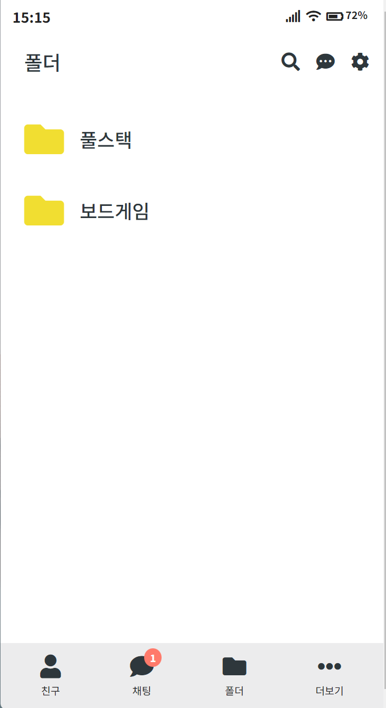

# My KaKao Talk 💬📂
카카오톡 리뉴얼 

    

## 1. Project Overview (프로젝트 개요)  

- **프로젝트 이름**: 카카오톡 리뉴얼

- **프로젝트 설명**: '폴더'기능이 추가된 카카오톡 앱 

    

## 2. Development Period (개발 기간)

### 개발 기간
-  2024-06-07 ~ 2024-06-14

    

## 3. Tech Stack (기술 스택)

### Frontend

### Tools

  

## 4. Site Link (사이트 링크)
http://43.200.56.159/

  

## 5. Site Introduction (사이트 소개)

| 기능 명 | 설명 | 스크린샷 |
|---------|------|-----------|
| 채팅 목록 페이지 | 이 페이지는 진행 중인 채팅 목록을 보여줍니다. 그룹 채팅과 개인 채팅을 포함하여, 최신 메시지, 읽지 않은 메시지 수, 시간 정보 등을 쉽게 확인할 수 있습니다. |  |
| 폴더 관리 페이지 | 폴더 관리 페이지에서는 사용자가 채팅방을 다양한 폴더로 분류할 수 있습니다. 주제나 프로젝트, 선호도에 따라 채팅방을 정리할 수 있습니다. |  |
| 전체 폴더 보기 | 전체 폴더 보기에서는 특정 폴더에 속한 채팅방과 친구 목록을 보여줍니다. 사용자는 다른 폴더 간에 필터링하고 쉽게 탐색할 수 있습니다. |  |
| 친구 목록 페이지 | 친구 목록 페이지에서는 사용자의 친구 목록을 보여줍니다. 친구의 생일을 강조하고 새로운 친구 추천 기능을 제공합니다. 멀티 프로필 기능을 통해 다양한 프로필 간 전환이 가능합니다. |  |
| 더보기 옵션 페이지 | '더보기' 페이지에서는 선물하기, 쇼핑, 게임 등 다양한 추가 서비스에 접근할 수 있습니다. 사용자 지갑의 잔액과 거래 내역을 확인할 수 있습니다. |  |
| 보드게임 폴더 보기 | 보드게임 폴더 보기에서는 특정 폴더를 중심으로 보드게임 관련 채팅방과 친구를 관리할 수 있습니다. |  |

